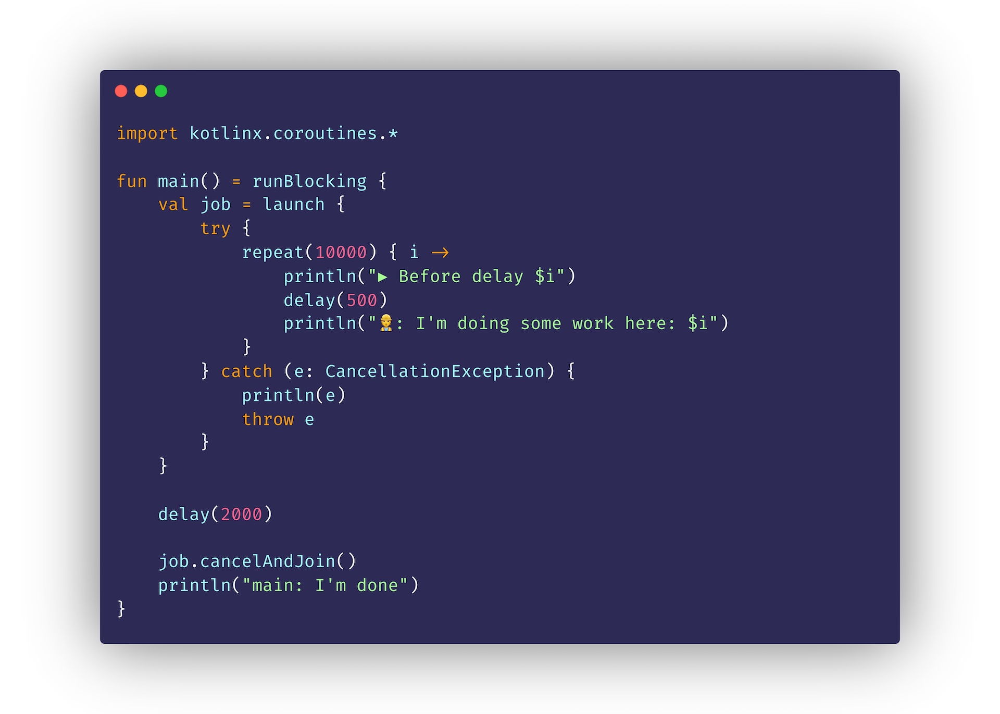

# Heise Academy: "Kotlin Coroutines"

In diesem Repository findest du Beispiele und Code-Stände des Videokurses "Kotlin Coroutines" von Hauke Brammer bei heise academy.

## Inhalt
### Setup
[📁 Ordner `01_03`](01_03)

Hier findest ein fertiges Gradle-Projekt, dass du verwenden kannst, um direkt mit dem Programmieren loszulegen. 

### Beispiele und Code-Stände
Hier findest du die verschiedenen Code-Stände aus den Lektionen des Kurses.

#### Meine erste Coroutine
[📁 Ordner `02_02`](02_02)

#### Scopes, Contexts und Dispatchers
[📁 Ordner `02_03`](02_03)

#### Cancellation und Timeouts
[📁 Ordner `02_04`](02_04)

#### Das Zusammespiel mehrerer Coroutines
[📁 Ordner `02_05`](02_05)

#### Exceptions werfen und fangen
[📁 Ordner `03_02`](03_02)

#### Testen von Kotlin Coroutines
[📁 Ordner `03_03`](03_03)

#### Flows: Mehrere Werte aus einer Funktion zurückgeben
[📁 Ordner `04_02`](04_02)

#### Flow Lifecycle: Auf Ereignisse reagieren
[📁 Ordner `04_03`](04_03)

#### Intermediate Operators: Mit Werten in Flows arbeiten
[📁 Ordner `04_04`](04_04)

#### Terminal Operators: Werte aus Flows einsammeln
[📁 Ordner `04_05`](04_05)

#### Channels: Mehrere Coroutines miteinander verbinden
[📁 Ordner `04_06`](04_06)
